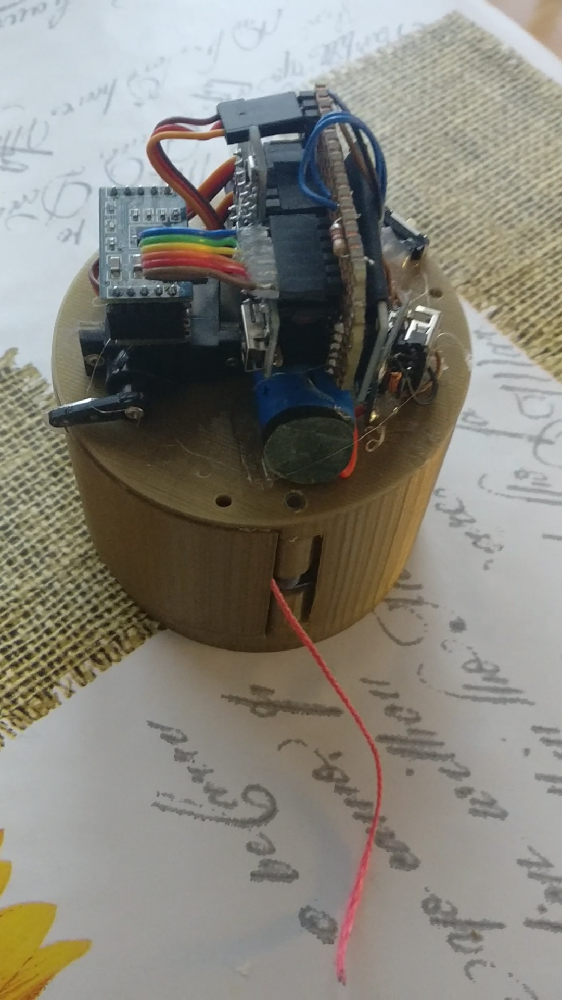
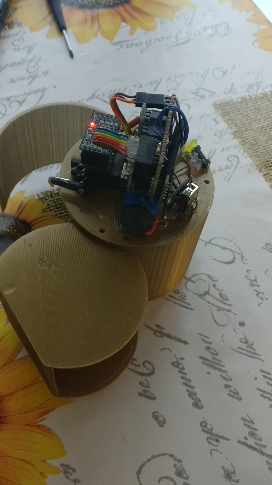

Rochet Control V1.0
===================== 
Controller board for water rocket.
Auto paracute eject and data are logged on SD card for acceleration and altitude. 

Project preview
=====================

License and copyright
=====================

Copyright 2017-2018 sandroxGH infomsystemsrl@gmail.com

Licensed under the Apache License, Version 2.0 (the "License"); you may not use this file except in compliance with the License. You may obtain a copy of the License at http://www.apache.org/licenses/LICENSE-2.0

Unless required by applicable law or agreed to in writing, software distributed under the License is distributed on an "AS IS" BASIS, WITHOUT WARRANTIES OR CONDITIONS OF ANY KIND, either express or implied. See the License for the specific language governing permissions and limitations under the License.
